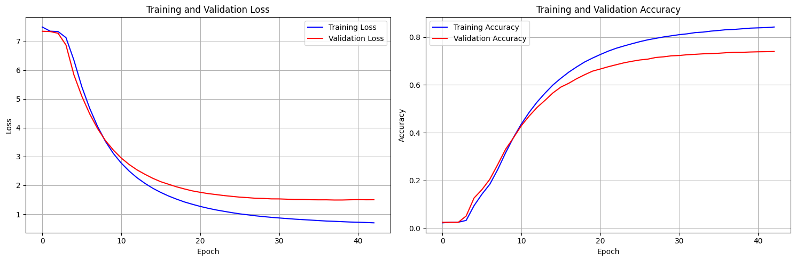
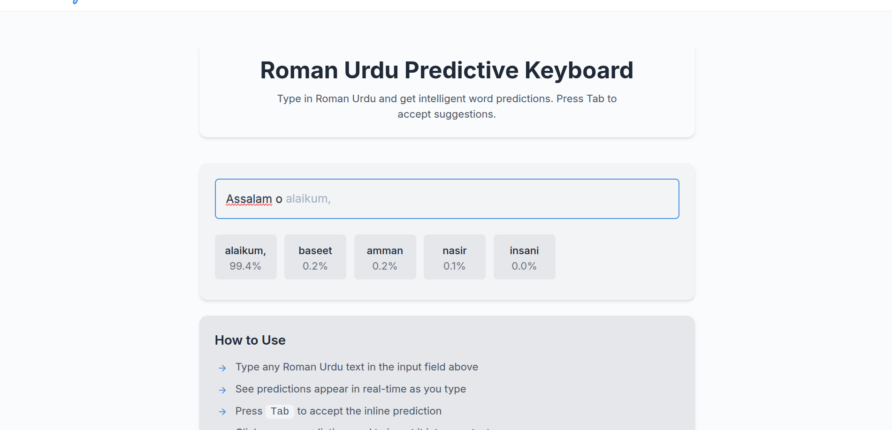

# LSTM Roman Urdu Text Predictor

## Overview

This document summarizes the development and performance of an LSTM-based model for next-word prediction in Roman Urdu. The model was trained through multiple iterations to optimize both accuracy and generalization.

## Model Specs

- **Architecture**: Multi-layer LSTM
- **Device**: CUDA-enabled GPU
- **Task**: Next-word prediction
- **Data**: Variable-length sequences (padded), vocabulary grows with iterations

---

| Epoch | Train Loss | Train Accuracy | Val Loss | Val Accuracy |
|-------|------------|----------------|----------|--------------|
| 1     | 7.5012     | 2.32%          | 7.3539   | 2.54%        |
| 10    | 3.1085     | 38.06%         | 3.2255   | 37.93%       |
| 20    | 1.3435     | 71.21%         | 1.8085   | 65.74%       |
| 30    | 0.8897     | 80.53%         | 1.5308   | 72.15%       |
| 40    | 0.7264     | 83.73%         | 1.4992   | 73.76%       |

> **Note**: Early stopping triggered at epoch 43 due to no improvement in validation performance for 5 consecutive epochs.
---

## Key Improvements

- **Data Scaling**: Sequences increased from 328K to 452k; vocabulary from 11K to 12K+
- **Training Strategy**:
  - Reduced epochs with faster convergence
  - Improved accuracy/loss in Iteration 2
  - Final model focused on generalization, not overfitting
- **Prediction Examples**:
  - *"Sabar ka phal"* → **meetha** (99.6%)
  - *"Allah behtar"* → **janta** (98.2%)
  - *"Mujhy kal sy neend"* → **nahi** (88.3%)

---

## Performance Graph

---

## How It Works

Below are visual examples of the deployed Roman Urdu LSTM predictor in action. The interface supports:

- Real-time next-word prediction as the user types
- Grey inline suggestions with `Tab` key acceptance
- Probability display for alternate predictions

### 🔹 Typing Interface with Inline Prediction

> *Note: UI images are from the live version of the deployed model.*

---

## Observations

- Iteration 2 achieved highest training performance but showed overfitting.
- Final iteration prioritized generalization using more data and better regularization.
- Model performs well on idioms, cultural phrases, and informal text patterns.

---

## Future Work

- Add attention mechanisms or Transformers for richer context modeling
- Fine-tune on domain-specific Roman Urdu text
- Expand dataset diversity (poetry, chat, blogs, etc.)

